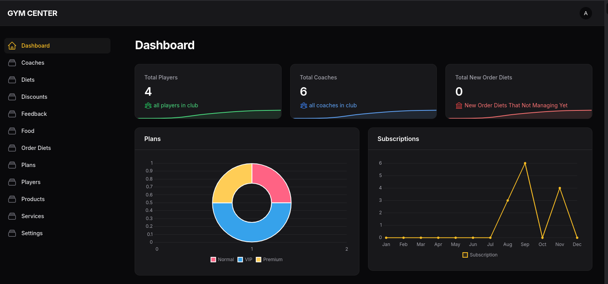

# Gym_center
The Gym Center Management System is a comprehensive software application designed to streamline the operations of gym and fitness centers.
## Dashboard only for admin && Backend for app GYM for player and coach
### ___________________________________
### URL:http://127.0.0.1:8000/admin 
#### email:admin@gmail.com 
#### password:password
### ___________________________________


## Installation:

```
git clone https://github.com/ibrahimAlAssi/Gym_center.git
```

```
cd Gym_center
```

```
composer install
```

```
cp .env.example .env
```

```
php artisan migrate:fresh --seed
```

```
php artisan db:seed
```

```
php artisan serve
```
